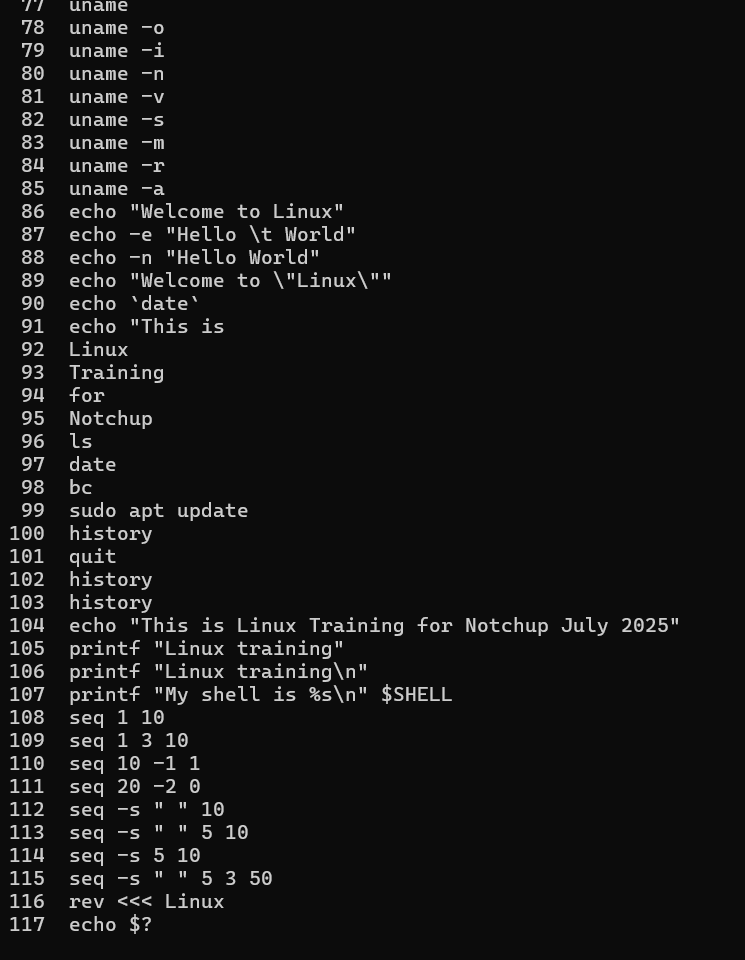

## Agile Course Screenshot

here are some screenshot for agile course

## GIT Course certificate

here is git course certificate 

[View Git Certificate](git/git.certificate.pdf)

# Linux Programming Screenshots

Here are some screenshots for linux programming:

  
  
  

  

## C Programming Images

Here are some images from the c_programming folder:

# Week 1 DSA Solutions

### Day 1

- [Plus Minus](Day1/PlusMinus.java)
- [Mini-Max Sum](Day1/MiniMaxSum.java)

### Day 2

- [Time Conversion](Day2/TimeConversion.java)
- [Sparse Arrays](Day2/SparseArrays.java)

### Day 3

- [Lonely Integer](Day3/LonelyInteger.java)
- [Flipping Bits](Day3/FlippingBits.java)

### Day 4

- [Counting Sort 1](Day4/CountingSort1.java)
- [Diagonal Difference](Day4/DiagonalDifference.java)

### Day 5

- [Pangrams](Day5/Pangrams.java)
- [Permuting Two Arrays](Day5/PermutingTwoArrays.java)

### Day 6

- [Subarray Division 1](Day6/SubarrayDivision1.java)

### Day 7

- [XOR Strings 2](Day7/XORStrings2.java)

